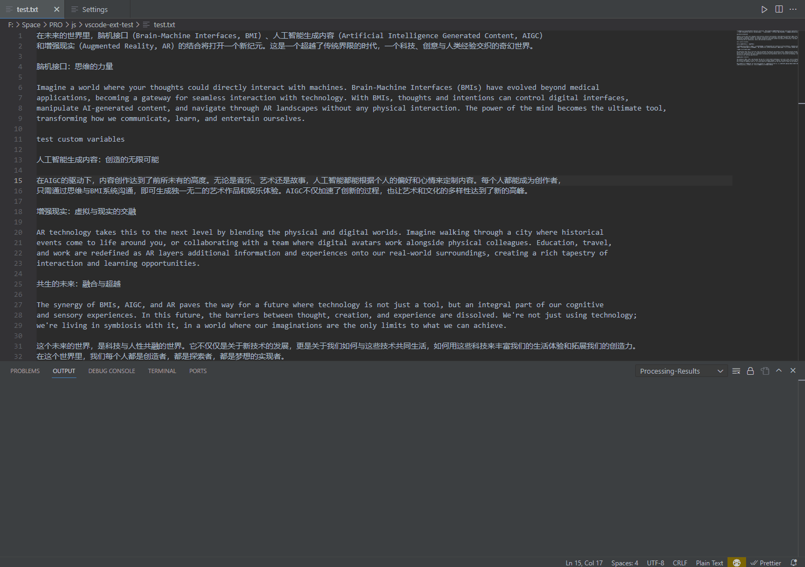
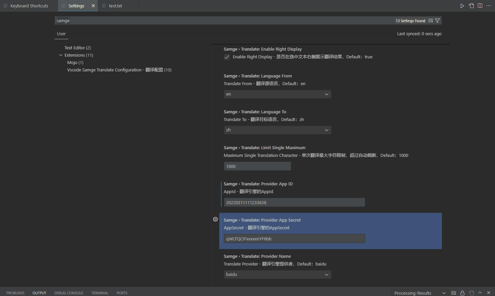
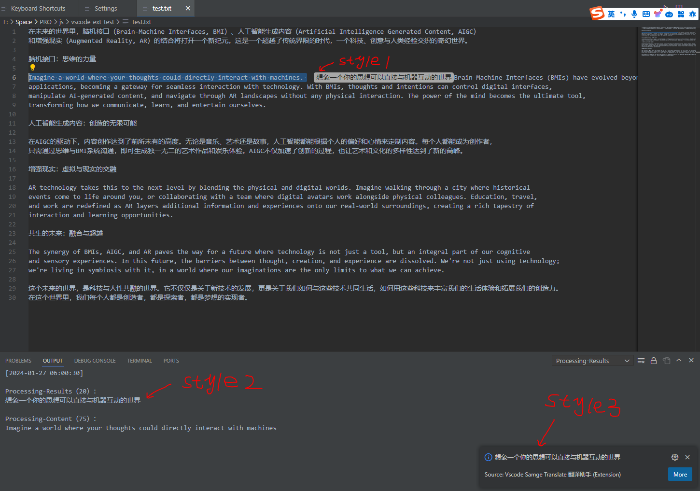
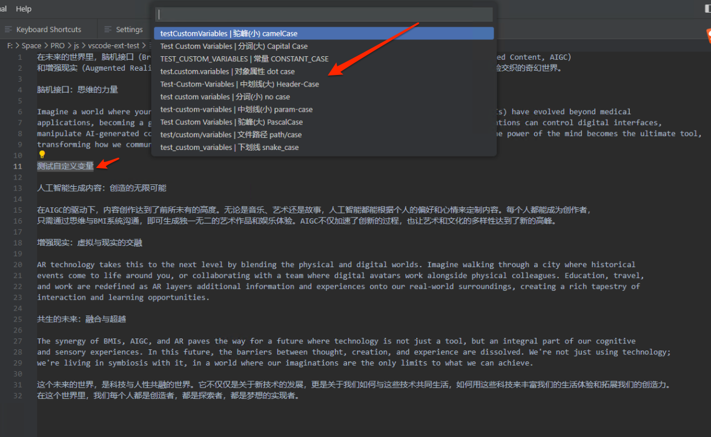
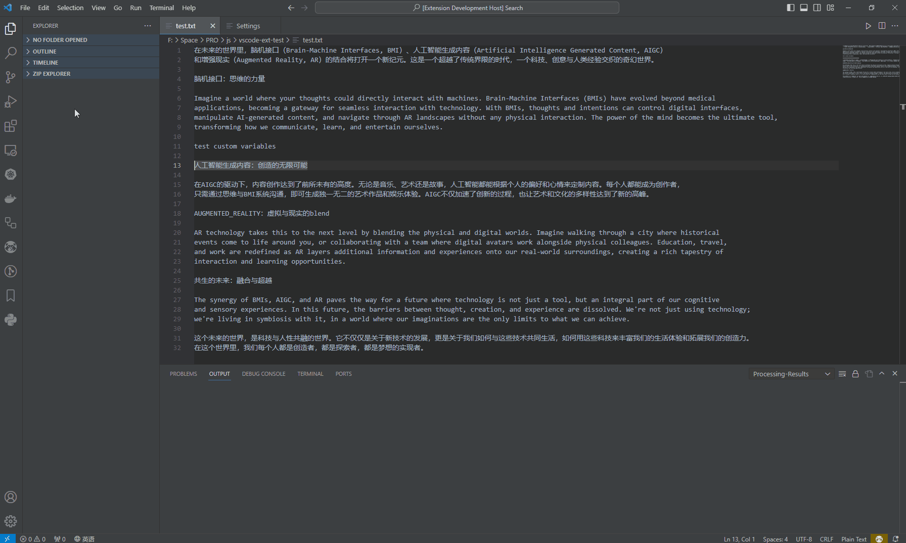
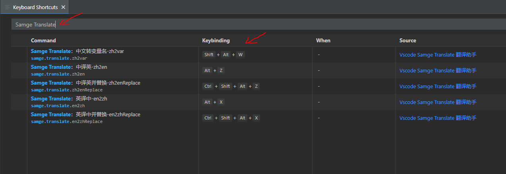
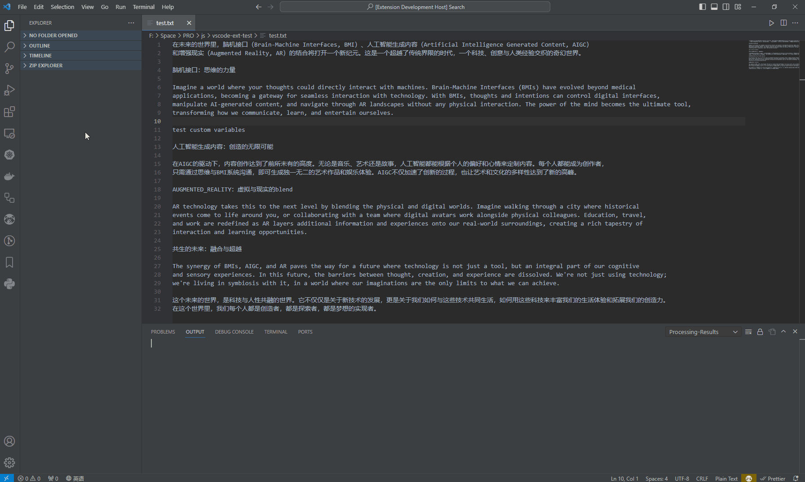
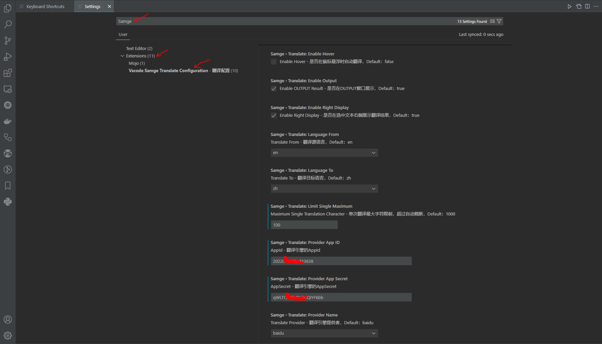

# VSCode Samge Translate 翻译助手 插件

[中文文档](README-zh.md) | [English](README.md) | [Github](https://github.com/Samge0/vscode-samge-translate)  

VSCode Samge Translate 是一个基于VSCode的`翻译插件`，提供了从`英文到中文`、从`中文到英文`的翻译功能，以及`中文转变量名`功能支持多规则变量名（`camelCase、capitalCase、constantCase、dotCase、headerCase、noCase、paramCase、pascalCase、pathCase、snakeCase`）转换操作。使用百度/其他`翻译引擎API`来实现准确的翻译结果。 

当前支持的翻译引擎包括：`百度`、`阿里`、`腾讯`、`火山`、`有道`、`DeepL`。 

这个GIF展示本插件的翻译功能交互，翻译结果可在选中文本后面展示、OUTPUT面板展示、右下角提示框展示、鼠标放在文本上悬浮展示，这些展示方式可在配置中开启或关闭。

## 安装

您可以通过VSCode扩展市场搜索 "VSCode Samge Translate" 来安装此插件。

## 功能

- **英文翻译成中文**：可以将选中的英文文本翻译成中文。
- **英文翻译成中文-自动替换**：可以将选中的英文文本翻译成中文，并自动替换原选择文本。
- **中文翻译成英文**：可以将选中的中文文本翻译成英文。
- **中文翻译成英文-自动替换**：可以将选中的中文文本翻译成英文，并自动替换原选择文本。
- **中文转变量名-自动替换**：支持将中文自动转换成多种编程命名格式的英文变量名。
- **配置灵活**：可通过VSCode设置自定义翻译引擎参数等。

### 快捷键信息（可自行修改）

| 命令名称 | 预置快捷键（Windows/Linux） | 预置快捷键（macOS） |
| --- | --- | --- |
| Samge Translate：英译中-en2zh | alt+x | alt+x |
| Samge Translate：英译中并替换-en2zhReplace | ctrl+shift+alt+x | ctrl+shift+alt+x |
| Samge Translate：中译英-zh2en | alt+z | alt+z |
| Samge Translate：中译英并替换-zh2enReplace | ctrl+shift+alt+z | ctrl+shift+alt+z |
| Samge Translate：中文转变量名-zh2var | shift+alt+w | shift+alt+w |

### 配置项信息

| 配置项 | 类型 | 默认值 | 描述 |
| --- | --- | --- | --- |
| samge.translate.enable | boolean | true | 是否启用插件 |
| samge.translate.enableHover | boolean | false | 是否在鼠标悬浮时自动翻译 |
| samge.translate.enableOutput | boolean | true | 是否在OUTPUT窗口展示 |
| samge.translate.enableRightDisplay | boolean | true | 是否在选中文本右侧展示翻译结果 |
| samge.translate.languageFrom | string | en | 翻译源语言 |
| samge.translate.languageTo | string | zh | 翻译目标语言 |
| samge.translate.providerName | string | baidu | 翻译引擎提供者 |
| samge.translate.providerAppId | string |  | 翻译引擎的AppId |
| samge.translate.providerAppSecret | string |  | 翻译引擎的AppSecret |
| samge.translate.limitSingleMaximum | integer | 1000 | 单次翻译最大字符限制 |

## 快捷键和配置的编辑方法

您可以通过以下步骤来编辑快捷键和配置项：

1. **编辑快捷键**：在VSCode中，通过 `File > Preferences > Keyboard Shortcuts` (文件 > 首选项 > 键盘快捷方式) 来设置您的快捷键（可搜索关键词`samge`快速定位相关配置项）。
2. **编辑配置**：在VSCode中，通过 `File > Preferences > Settings > Extensions > Vscode Samge Translate Configuration` (文件 > 首选项 > 设置 > 扩展 > Vscode Samge Translate Configuration) 来设置您的配置项（可搜索关键词`samge`快速定位相关配置项）。

## 常见问题

- [如何获取appId和appSecret]()？
    - [百度](https://api.fanyi.baidu.com/api/trans/product/prodinfo)：5万免费字符/月 (个人认证后可切换高级版：100w免费字符/月)
    - [阿里](https://www.aliyun.com/product/ai/base_alimt?source=5176.11533457&userCode=wsnup3vv)：：100万免费字符/月
    - [腾讯](https://cloud.tencent.com/document/product/551/35017?fromSource=gwzcw.1293314.1293314.1293314&cps_key=963fb04b6aae26f0014088af393dccf1)：：500万免费字符/月
    - [火山](https://www.volcengine.com/docs/4640/68515)：：200万免费字符/月
    - [有道](https://ai.youdao.com/DOCSIRMA/html/trans/price/wbfy/index.html)：：新账号有50元固定免费体验额度
    - [deepl](https://www.deepl.com/zh/pro#developer)：：50万免费字符/月

- 当前支持的翻译引擎有哪些？
    - [x] 百度 (baidu)
    - [x] 阿里 (alibaba)
    - [x] 腾讯 (tencent)
    - [x] 火山 (volcano)
    - [x] 有道 (youdao)
    - [x] DeepL (deepl)

- 当前支持的翻译语言有哪些？
    - [x] en
    - [x] zh

## 更新记录

[点击这里查看更新记录>>](./CHANGELOG.md)

---

## 贡献

如果您有任何建议或代码贡献，欢迎通过GitHub仓库提交问题或拉取请求。

## 版权和许可

此VSCode插件遵循MIT许可证发布。

### 相关截图
自动缓存翻译引擎配置参数，方便切换：

翻译的多种结果展示方式：

中文转变量名（中英混合/纯英文也可以转不同驼峰规则变量名）：

自定义快捷键.gif：

自定义快捷键：

配置信息.gif：

配置信息：

### Dev

[点击这里查看插件开发相关内容>>](./README-dev.md)

### 技术交流
- [Join Discord >>](https://discord.com/invite/eRuSqve8CE)
- WeChat：`SamgeApp`
