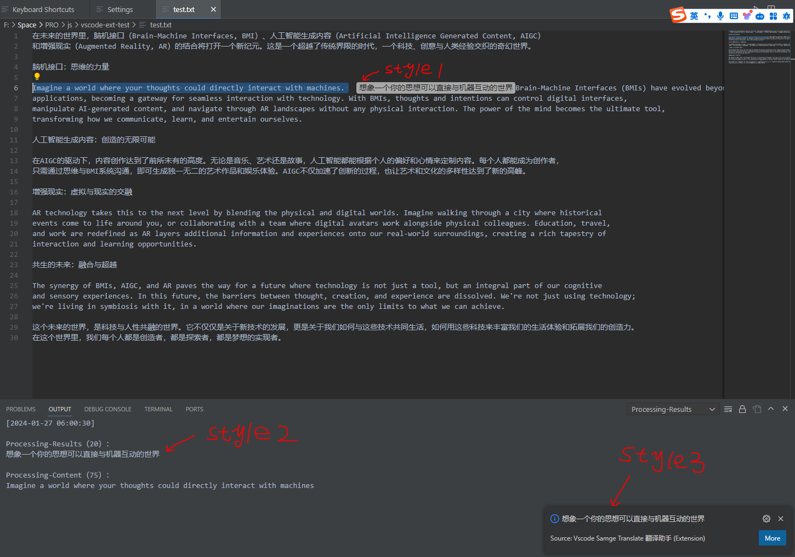
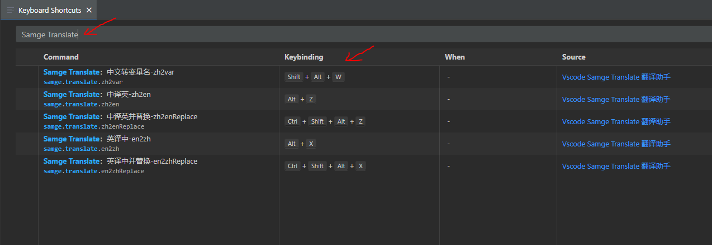

# VSCode Samge Translate Plugin

[中文文档](README-zh.md) | [English](README.md)  

VSCode Samge Translate is a translation plugin for VSCode that offers translation services from English to Chinese and vice versa. It also provides a feature for converting Chinese text into variable names, supporting multiple naming conventions such as `camelCase`, `capitalCase`, `constantCase`, `dotCase`, `headerCase`, `noCase`, `paramCase`, `pascalCase`, `pathCase`, and `snakeCase`. This plugin leverages APIs from Baidu and other translation engines to deliver accurate translations.

## Installation

You can install this plugin through the VSCode Extension Marketplace by searching for "VSCode Samge Translate".

## Features

- **English to Chinese Translation**: Translates selected English text into Chinese.
- **English to Chinese Translation - Auto Replace**: Translates and automatically replaces selected English text with its Chinese translation.
- **Chinese to English Translation**: Translates selected Chinese text into English.
- **Chinese to English Translation - Auto Replace**: Translates and automatically replaces selected Chinese text with its English translation.
- **Chinese to Variable Name Conversion - Auto Replace**: Automatically converts Chinese text into variable names in various programming naming formats.
- **Flexible Configuration**: Customize translation engine parameters and more through VSCode settings.

### Keyboard Shortcuts (Customizable)

| Command Name | Default Shortcut (Windows/Linux) | Default Shortcut (macOS) |
| ------------ | ------------------------------- | ----------------------- |
| Samge Translate：英译中-en2zh | alt+x | alt+x |
| Samge Translate：英译中并替换-en2zhReplace | ctrl+shift+alt+x | ctrl+shift+alt+x |
| Samge Translate：中译英-zh2en | alt+z | alt+z |
| Samge Translate：中译英并替换-zh2enReplace | ctrl+shift+alt+z | ctrl+shift+alt+z |
| Samge Translate：中文转变量名-zh2var | shift+alt+w | shift+alt+w |

### Configuration Options

| Setting | Type | Default Value | Description |
| ------- | ---- | ------------- | ----------- |
| samge.translate.enable | boolean | true | Enables/Disables the plugin |
| samge.translate.enableHover | boolean | false | Enables automatic translation on mouse hover |
| samge.translate.enableOutput | boolean | true | Displays translations in the OUTPUT window |
| samge.translate.enableRightDisplay | boolean | true | Shows translation results next to the selected text |
| samge.translate.languageFrom | string | en | Source language for translation |
| samge.translate.languageTo | string | zh | Target language for translation |
| samge.translate.providerName | string | baidu | Translation engine provider |
| samge.translate.providerAppId | string |  | AppId for the translation engine |
| samge.translate.providerAppSecret | string |  | AppSecret for the translation engine |
| samge.translate.limitSingleMaximum | integer | 1000 | Maximum character limit per translation |

## Editing Keyboard Shortcuts and Configuration

Follow these steps to modify keyboard shortcuts and settings:

1. **Edit Keyboard Shortcuts**: In VSCode, go to `File > Preferences > Keyboard Shortcuts` to set up your shortcuts.
2. **Edit Configuration**: In VSCode, navigate to `File > Preferences > Settings > Extensions > Vscode Samge Translate Configuration` for configuration options.

## Common Questions

- How to obtain appId and appSecret?
    - [Baidu](https://api.fanyi.baidu.com/api/trans/product/prodinfo): 50,000 free characters/month (personal authentication allows for an upgrade to the advanced version: 1,000,000 free characters/month)
    - [Alibaba](https://www.aliyun.com/product/ai/base_alimt?source=5176.11533457&userCode=wsnup3vv): 1,000,000 free characters/month
    - [Tencent](https://cloud.tencent.com/document/product/551/35017?fromSource=gwzcw.1293314.1293314.1293314&cps_key=963fb04b6aae26f0014088af393dccf1): 5,000,000 free characters/month
    - [Volcano Engine](https://www.volcengine.com/docs/4640/68515): 2,000,000 free characters/month
    - [Youdao](https://ai.youdao.com/DOCSIRMA/html/trans/price/wbfy/index.html): New accounts receive a fixed free experience quota of 50 CNY
    - [DeepL](https://www.deepl.com/zh/pro#developer): 500,000 free characters/month

- What translation engines are currently supported?
    - <input type="checkbox" checked>Baidu</input>
    - <input type="checkbox">Alibaba</input>
    - <input type="checkbox">Tencent</input>
    - <input type="checkbox">Volcano Engine</input>
    - <input type="checkbox">Youdao</input>
    - <input type="checkbox">DeepL</input>

- What translation languages are currently supported?
    - <input type="checkbox" checked>English (en)</input>
    - <input type="checkbox" checked>Chinese (zh)</input>

## Release Notes

### Version 0.0.1

Development of a VSCode translation plugin using the Baidu translation engine is complete. This version provides translation features from English to Chinese and vice versa, as well as a feature for converting Chinese into variable names supporting multiple naming rules (`camelCase`, `capitalCase`, `constantCase`, `dotCase`, `headerCase`, `noCase`, `paramCase`, `pascalCase`, `pathCase`, `snakeCase`).

---

## Contributions

If you have any suggestions or code contributions, please feel free to submit issues or pull requests via the GitHub repository.

## Copyright and License

This VSCode plugin is released under the MIT License.

### Related Screenshots

Various display styles for translations:

Chinese to variable name conversion (supports converting mixed Chinese/English or pure English into different camelCase rules):

Customizing keyboard shortcuts:

Configuration information:

### Technical Communication

- [Join Discord >>](https://discord.com/invite/eRuSqve8CE)
- WeChat: `SamgeApp`
